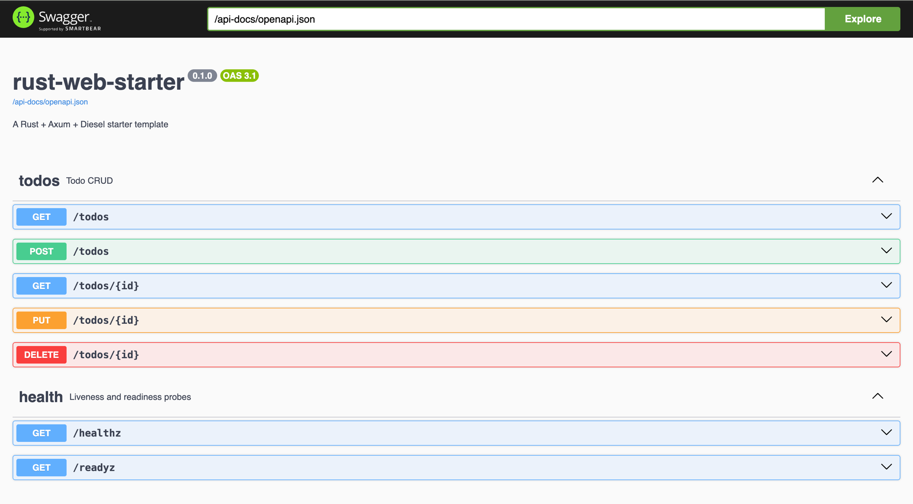

# rust-web-starter

A minimal Rust web service starter.

**Stack:** Axum 0.8, Diesel 2.3 + diesel-async (SQLite or Postgres), utoipa (OpenAPI + Swagger), tower-http (tracing + CORS), bacon.

## Quick start

```sh
make dev
```

Defaults to SQLite, which is bundled and compiled from source. No database to install, no Docker, no setup step. Migrations run automatically at boot.

- API: http://localhost:4563
- Swagger UI: http://localhost:4563/docs



Copy `.env.example` to `.env` to change any setting.

## Postgres

```sh
make docker-up                                    # Postgres + app in containers
cargo build --no-default-features --features postgres   # local build
```

The two backends are mutually exclusive and chosen at compile time. Plain `--features postgres` enables both and deliberately fails with a `compile_error!`, so always pass `--no-default-features` with it.

## Endpoints

| Method | Path | Purpose |
|---|---|---|
| GET | `/healthz` | Liveness. Never touches the database, so a database blip cannot get the process killed. |
| GET | `/readyz` | Readiness. Checks out a connection and runs `SELECT 1`. |
| GET | `/todos` | List, paginated (`limit` max 100, `offset`) |
| POST | `/todos` | Create |
| GET | `/todos/{id}` | Fetch one |
| PUT | `/todos/{id}` | Update |
| DELETE | `/todos/{id}` | Delete |

## Make targets

| Target | Purpose |
|---|---|
| `make dev` | Hot reload, rebuild and restart on save |
| `make run` | Start the server |
| `make build` | Compile |
| `make test` | Test on SQLite, needs no external services |
| `make test-pg` | Test on Postgres, starting a throwaway server unless `DATABASE_URL` is set |
| `make migrate` / `make migrate-pg` | Run migrations |
| `make schema` | Regenerate `src/db/schema.rs` |
| `make fmt` / `make lint` / `make check` | Format, lint, and full check across both backends |
| `make docker-up` / `make docker-down` | Compose up and down |

## Adding an entity

Copy `src/todos/` to `src/<name>/` and rename through it, add a migration under **both** `migrations/sqlite/` and `migrations/postgres/`, run `make schema`, then register the router in `src/lib.rs`.

There is deliberately no generic repository or CRUD macro. Diesel's query builder resists that kind of abstraction (its own maintainers advise against it), and the five query functions per entity are short enough that copying a directory is cheaper than parameterizing one. Diesel's derives are the base model layer.

Keep new columns to types both backends share. There is a single `schema.rs` covering both, which is what keeps every `#[cfg]` in the codebase confined to `src/db/mod.rs`.

## Notes

- `ALLOWED_ORIGINS` is empty by default, so no cross-origin requests are permitted. Set it explicitly in production. CORS is never permissive here.
- SQLite is not natively async. It runs through diesel-async's `SyncConnectionWrapper`, which is `spawn_blocking` underneath. Postgres is natively async.
- The `NOT NULL` on the SQLite `todos.id` column is load-bearing, not redundant. SQLite reports `notnull=0` for any `INTEGER PRIMARY KEY` because it is a rowid alias, so without it Diesel generates `Nullable<Integer>` and no longer matches Postgres.
